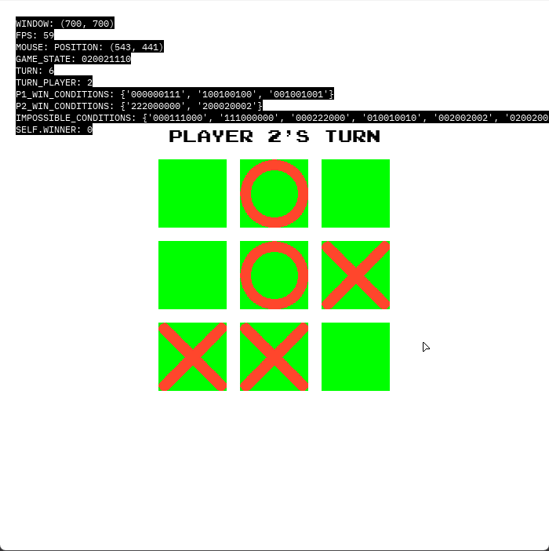
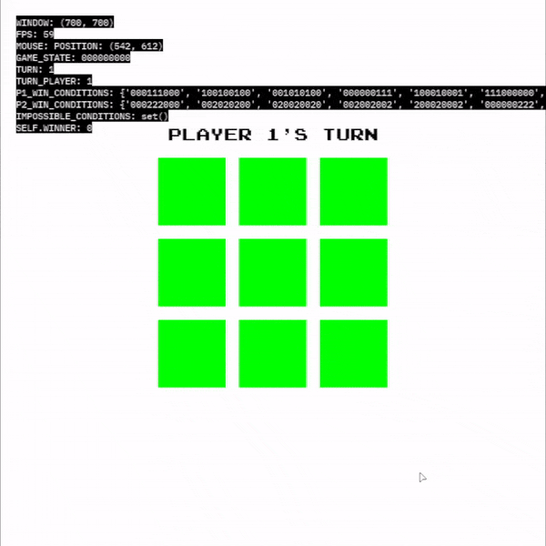

# Tic Tac Toe Game with Pygame

A simple Tic Tac Toe game implemented using Pygame.

## Introduction

This project is a basic implementation of the classic Tic Tac Toe game using the Pygame library. It includes features like mouse control, a debug mode, and a simple graphical user interface.

## Installation

### Prerequisites

- Python 3.12
- Pygame library (version 2.5.2 or later)

### Installation Steps

1. Clone the repository:
```bash
git clone https://github.com/gvlk/tic-tac-toe.git
```

2. Navigate to the project directory:
```bash
cd tic-tac-toe
```

3. Install dependencies:
```bash
pip install -r requirements.txt
```
## Usage

Run the game using the following command:

```bash
python main.py
```

### Command Line Options

-d or --debug: Activate debug mode

## Screenshots




## Contributing

Feel free to contribute to the development of this project!

1. Fork the repository.
2. Make your changes.
3. Submit a pull request.

Your contributions are appreciated!

## License

This project is licensed under the MIT License.
